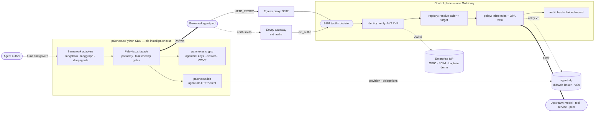

# PaloNexus Docs

The PaloNexus documentation site — built with [Astro](https://astro.build) +
[Starlight](https://starlight.astro.build) and served from the **`/docs`** context.

Covers developer integration, the Python SDK reference, operations (Go + Terraform),
self-hosting, architecture/features, and an HTTP API reference.

## How PaloNexus fits together

An agent author builds and governs an agent through the **`palonexus` Python SDK** — its
`crypto` layer mints the agent's `did:web` identity and verifiable presentations, its `idp`
layer talks to **agent-idp** for provisioning and delegations, and `pn.task(...)` gates wrap
every action. At runtime the governed agent's calls flow through the Envoy gateway
(north-south) or the egress proxy (the agent's outbound calls) into the Go **control plane**,
which renders one `/authz` decision — verify identity, resolve caller and target, evaluate
policy with an OPA veto, and append a hash-chained audit record — before anything reaches an
upstream model, tool, service, or peer.



*The product end to end: the `palonexus` SDK is the developer front door for agent identity,
delegations, and runtime gates; every governed call still resolves to one control-plane
`/authz` decision before it reaches an upstream. Deep-dive: [Architecture](/docs/concepts/architecture/)
and the [SDK reference](/docs/sdk/).*

## Local development

```sh
npm install
npm run dev        # http://localhost:4321/docs/
npm run build      # static site -> dist/  (+ Pagefind search index)
npm run preview    # serve the built static site
```

The site is **static** (no adapter); `dist/` can be served by any static host.

Validate the way CI does before pushing:

```sh
npm run validate   # Prettier format check + docs build + Playwright E2E
```

## Deployment

Publishing is **CI-only**. The site is deployed to the Cloudflare Worker `palonexus-docs`
(served at `palonexus.ai/docs`) **only** by GitHub Actions on a push to `main`, and **only
after** the Playwright E2E tests pass. There is no laptop deploy path — `npm run deploy`
intentionally refuses and points you to the release guide.

- Pipeline: [`.github/workflows/docs-ci-deploy.yml`](.github/workflows/docs-ci-deploy.yml)
- Full process (local validation, PR checks, merge behavior, verification, rollback,
  troubleshooting, required secrets): **`src/content/docs/operations/releasing-the-docs.md`**
  (published at `/docs/operations/releasing-the-docs/`).
- Required GitHub secrets: `CLOUDFLARE_API_TOKEN`, `CLOUDFLARE_ACCOUNT_ID` (see `.env.example`).

## Structure

```
astro.config.mjs            # base: '/docs', Starlight integration + sidebar (6 sections)
src/content.config.ts       # Starlight docs collection
src/content/docs/
  index.md                  # home (splash)
  getting-started/          # overview, concepts, local quickstart
  develop/                  # developer integration guides
  sdk/                      # Python SDK reference (agentdid, palonexus_agent)
  operations/               # Go control-plane + Kustomize + Terraform/DOKS
  concepts/                 # architecture & features
  reference/                # HTTP API, headers, env vars
```

Content is authored in Markdown with Starlight frontmatter (`title`, `description`,
`sidebar.order`). The sidebar autogenerates per directory (see `astro.config.mjs`).
Source-of-truth drafts live in `../platform/docs/`.

## Add a page

Drop a `.md` file in the relevant `src/content/docs/<section>/` directory with:

```md
---
title: My page
description: One-line summary.
sidebar:
  order: 5
---
```

Cross-link with root-relative paths under the base, e.g. `/docs/sdk/agentdid/`.
